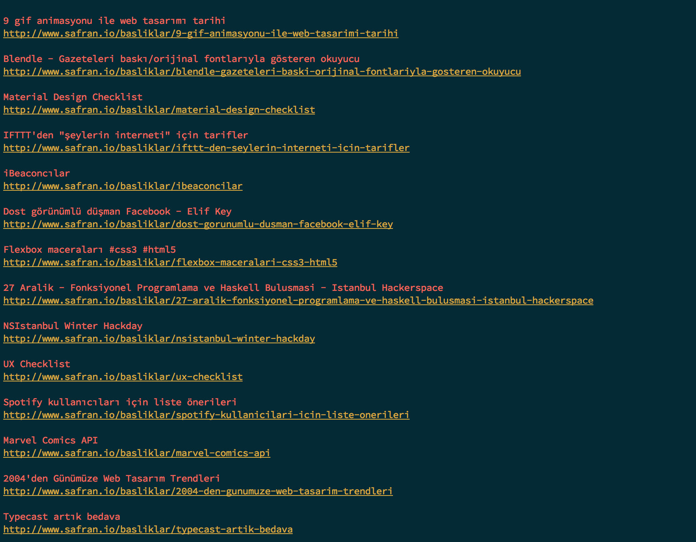

# safran-clj

Safran.io sitesinin haber yayınını okumak için Clojure ile yazılmış bir komut satırı uygulaması.

## Kurulum ve Kullanım

```bash
$ git clone https://github.com/turhn/safran-clj
$ cd safran-clj
$ lein run
```
ya da

```bash
$ lein uberjar
$ java -jar safran-0.1.0-standalone.jar
```

## Ekran Görüntüsü


## Lisans

###MIT###
